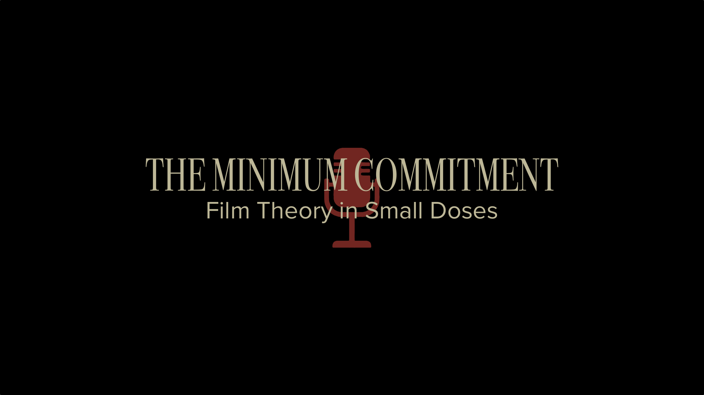

<link rel="stylesheet" href="./style.css">

# The Minimum Commitment

## Film Theory in Small Doses

A podcast about movies, meaning, and the ideas hiding beneath the surface.

Each episode takes one film and one theory, then breaks it down in a way that feels clear, useful, and connected to the experience of watching.

---

## Listen Now

Spotify

Apple Podcasts

Amazon Music

Episodes

---

## About the Show

...

---

## About Donn

...
